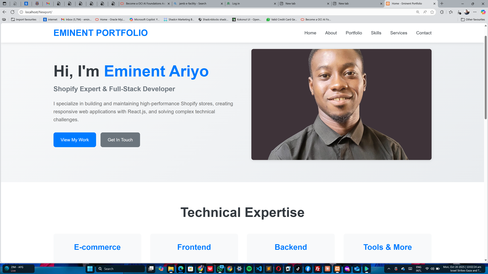

# 🌟 Professional Portfolio Website

A modern, responsive portfolio website built with PHP, HTML5, CSS3, and JavaScript. Designed to showcase skills in Shopify development, React.js, and full-stack web development.


*Screenshot of the portfolio homepage*

## 🚀 Live Demo

[View Live Demo](https://your-portfolio-url.com) *(Update with your actual URL)*

## ✨ Features

- 📱 **Fully Responsive Design** - Works seamlessly on desktop, tablet, and mobile devices
- 🎨 **Modern UI/UX** - Clean, professional design with smooth animations
- 🔍 **SEO Optimized** - Meta tags, sitemap, and semantic HTML for better search rankings
- 📊 **Dynamic Portfolio** - Filter projects by technology/category
- 📧 **Working Contact Form** - PHP-powered contact form with validation
- ⚡ **Fast Loading** - Optimized assets and efficient code
- 🛠️ **Easy to Customize** - Well-organized code structure
- 📂 **JSON Data Management** - Easy project and skills updates without touching code

## 🛠️ Technologies Used

### Frontend
- HTML5
- CSS3 (Flexbox, Grid, Animations)
- JavaScript (ES6+)
- Responsive Design (Mobile-first approach)

### Backend
- PHP 7.4+
- JSON for data storage
- MySQL (optional)

### Tools & Libraries
- Apache with mod_rewrite
- Git for version control
- No external dependencies (vanilla JS)

## 📂 Project Structure

```
portfolio-website/
├── index.php                  # Homepage
├── test.php                   # Testing utilities
├── .htaccess                  # URL rewriting rules
├── config/
│   ├── config.php             # Site configuration
│   └── database.php           # Database setup (optional)
├── includes/
│   ├── header.php             # Header component
│   ├── footer.php             # Footer component
│   └── functions.php          # Reusable PHP functions
├── pages/
│   ├── about.php              # About page
│   ├── portfolio.php          # Portfolio showcase
│   ├── skills.php             # Skills & expertise
│   ├── services.php           # Services offered
│   └── contact.php            # Contact form
├── components/
│   ├── project-card.php       # Project display component
│   ├── skill-item.php         # Skill display component
│   └── testimonial.php        # Testimonial component
├── assets/
│   ├── css/
│   │   ├── main.css           # Main stylesheet
│   │   ├── responsive.css     # Responsive styles
│   │   └── components.css     # Component styles
│   ├── js/
│   │   ├── main.js            # Main JavaScript
│   │   ├── portfolio.js       # Portfolio filtering
│   │   └── contact-form.js    # Form validation
│   └── images/                # Image assets
├── api/
│   ├── contact-handler.php    # Contact form processor
│   └── portfolio-data.php     # Portfolio API endpoint
├── data/
│   ├── projects.json          # Project data
│   └── skills.json            # Skills data
├── robots.txt                 # SEO robots file
├── sitemap.xml               # Site map
└── README.md                 # This file
```

## 🚀 Installation & Setup

### Prerequisites
- PHP 7.4 or higher
- Apache server with mod_rewrite enabled
- Web server (XAMPP, WAMP, MAMP, or live server)

### Local Development Setup

1. **Clone the repository**
   ```bash
   git clone https://github.com/yourusername/portfolio-website.git
   cd portfolio-website
   ```

2. **Configure the site**
   - Open `config/config.php`
   - Update `SITE_URL` to match your local setup:
     ```php
     define('SITE_URL', 'http://localhost/your-folder-name');
     ```
   - Update your personal information (email, phone, social media links)

3. **Set up your web server**
   - For XAMPP: Place the project folder in `C:\xampp\htdocs\`
   - For WAMP: Place the project folder in `C:\wamp64\www\`
   - For Mac MAMP: Place in `/Applications/MAMP/htdocs/`

4. **Enable Apache mod_rewrite** (if using clean URLs)
   - For XAMPP: Edit `httpd.conf` and uncomment `LoadModule rewrite_module`
   - Restart Apache server

5. **Access your site**
   ```
   http://localhost/Newport/
   ```

### Production Deployment

1. **Upload files to your web host**
   - Use FTP/SFTP to upload all files
   - Ensure proper file permissions (755 for directories, 644 for files)

2. **Update configuration**
   - Change `SITE_URL` in `config/config.php` to your domain
   - Set `DEBUG_MODE` to `false`
   - Set `ERROR_REPORTING` to `false`

3. **Configure email settings**
   - Update SMTP settings in `config/config.php` for contact form
   - Or configure PHP `mail()` function on your server

4. **Test functionality**
   - Test all navigation links
   - Test contact form submission
   - Check responsive design on multiple devices

## ⚙️ Configuration

### Personal Information
Edit `config/config.php` to update:
```php
define('SITE_NAME', 'Eminent Portfolio ');
define('EMAIL_TO', 'eminentemmylery@gmail.com');
define('PHONE', '+234-905-9020-272);
define('LOCATION', 'Lagos, Nigeria');
define('GITHUB_URL', 'https://github.com/EminentEmmy');
define('LINKEDIN_URL', 'https://www.linkedin.com/in/emmanuel-olawale-b3a830231?utm_source=share&utm_campaign=share_via&utm_content=profile&utm_medium=android_app');
```

### Adding Projects
Edit `data/projects.json`:
```json
{
  "projects": [
    {
      "id": 1,
      "title": "Portfolio",
      "description": "Project description",
      "technologies": ["PHP", "JavaScript", "CSS"],
      "categories": ["frontend", "backend"],
      "image": "project-image.jpg",
      "live_url": "https://project-url.com",
      "github_url": "https://github.com/username/repo",
      "featured": true
    }
  ]
}
```

### Adding Skills
Edit `data/skills.json`:
```json
{
  "skills": {
    "frontend": [
      {
        "name": "React.js",
        "level": 90,
        "description": "Building modern, interactive UIs"
      }
    ]
  }
}
```

## 🎨 Customization

### Changing Colors
Edit `assets/css/main.css` and modify CSS variables:
```css
:root {
    --primary-color: #007bff;
    --secondary-color: #6c757d;
    --dark-color: #343a40;
    --light-color: #f8f9fa;
}
```

### Adding New Pages
1. Create a new PHP file in `pages/` directory
2. Add navigation link in `includes/header.php`
3. Follow existing page structure for consistency

### Modifying Layout
- Edit `includes/header.php` for navigation changes
- Edit `includes/footer.php` for footer modifications
- Modify `assets/css/main.css` for styling changes

## 📧 Contact Form Setup

The contact form requires email configuration:

1. **Using Gmail SMTP** (Recommended)
   ```php
   define('SMTP_HOST', 'smtp.gmail.com');
   define('SMTP_PORT', 587);
   define('SMTP_USERNAME', 'eminentemmylery@gmail.com');
   define('SMTP_PASSWORD', 'your-app-password');
   ```
   Note: Use [Gmail App Password](https://support.google.com/accounts/answer/185833), not your regular password

2. **Using PHP mail()** function
   - Ensure your server supports `mail()` function
   - May require additional server configuration

## 🔒 Security Features

- Input sanitization and validation
- XSS protection with `htmlspecialchars()`
- SQL injection prevention (when using database)
- CSRF protection ready
- Secure headers via `.htaccess`
- Rate limiting on contact form
- Protected configuration files

## 📱 Browser Support

- ✅ Chrome (latest)
- ✅ Firefox (latest)
- ✅ Safari (latest)
- ✅ Edge (latest)
- ✅ Mobile browsers (iOS Safari, Chrome Mobile)

## 🐛 Troubleshooting

### Navigation Links Not Working
- Ensure `.htaccess` file exists in root directory
- Check if Apache `mod_rewrite` is enabled
- Verify `SITE_URL` in `config/config.php` matches your setup

### Contact Form Not Sending
- Check email configuration in `config/config.php`
- Verify server supports PHP `mail()` function
- Check spam folder for test emails

### CSS/JS Not Loading
- Verify file paths in HTML are correct
- Check file permissions (should be 644)
- Clear browser cache

### "Function Not Found" Errors
- Ensure `includes/functions.php` is loaded in each page
- Check file paths are correct (relative to page location)

## 📈 Performance Optimization

- ✅ Optimized images (compress before uploading)
- ✅ Minified CSS/JS ready
- ✅ Browser caching configured
- ✅ GZIP compression enabled
- ✅ Efficient PHP code
- ✅ Lazy loading support

## 🤝 Contributing

Contributions, issues, and feature requests are welcome!

1. Fork the project
2. Create your feature branch (`git checkout -b feature/AmazingFeature`)
3. Commit your changes (`git commit -m 'Add some AmazingFeature'`)
4. Push to the branch (`git push origin feature/AmazingFeature`)
5. Open a Pull Request

## 📝 License

This project is licensed under the MIT License - see the [LICENSE](LICENSE) file for details.

## 👤 Author

**Your Name**
- Website: [your-portfolio-url.com](https://your-portfolio-url.com)
- GitHub: [@yourusername](https://github.com/EminentEmmy)
- LinkedIn: [Your Name](https://linkedin.com/in/yourprofile)
- Twitter: [@yourusername](https://twitter.com/eminentemmy6)

## 🌟 Acknowledgments

- Design inspiration from modern portfolio trends
- Icons and images from [respective sources]
- Community feedback and suggestions

## 📞 Support

For support, email your-email@domain.com or open an issue in this repository.

---

**⭐ If you find this project helpful, please consider giving it a star!**

Made with ❤️ by Eminent Ariyo
